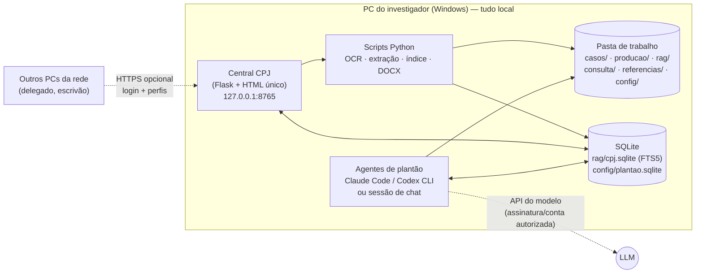
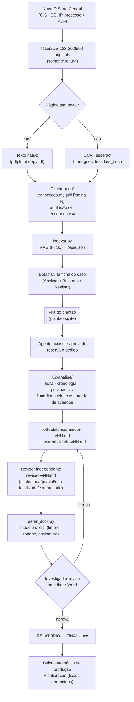
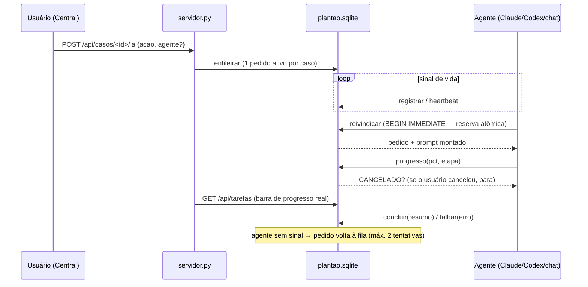
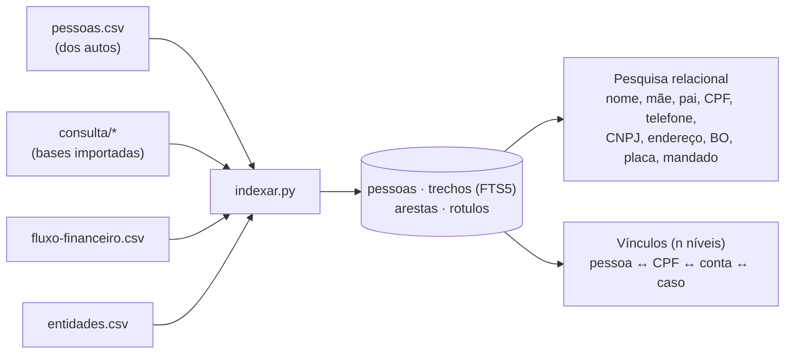

# Central CPJ: apresentação técnica

> Visão geral da arquitetura para revisão por um desenvolvedor. **Não contém dados de casos.**
> Estado em 27/09/2026. Plugin `investigacao-cpj` 0.2.0 (versão 0.3.0 em integração).

---

## 1. O problema

Um investigador de polícia produz de **30 a 50 relatórios de investigação por mês**, cada um a partir de um inquérito policial (IP) de **100 a 300 páginas em PDF**, quase sempre de fraude ou estelionato: Pix, falsa central, falso parente e parecidos.

O trabalho manual é:

1. ler o PDF;
2. achar pessoas, contas e valores;
3. montar o caminho do dinheiro;
4. escrever o relatório no modelo oficial em Word.

**Objetivo:** automatizar a parte mecânica (OCR, extração, organização, rascunho) e manter o humano como autor e revisor. A IA gera **minuta**. Quem confere e assina é o investigador.

**Restrições que moldam tudo:**

| Restrição | Consequência na arquitetura |
|---|---|
| Material sigiloso (art. 20 do CPP) | Tudo roda **local**; nada de nuvem própria; servidor escuta em `127.0.0.1` por padrão |
| A IA não pode inventar | Todo fato leva **localizador** (pág. do PDF / fls.); há um revisor independente; separa fato × relato × indício × lacuna |
| Um usuário principal e poucos colegas | Sem banco cliente-servidor: **arquivos + SQLite** bastam |
| O usuário não é programador | Scripts `.bat` com duplo clique; uma interface web única |
| Os tokens de uma IA podem acabar | Procedimentos **portáteis**: Claude, Codex, Gemini ou chat comum continuam o trabalho |

---

## 2. Visão geral



**Princípio central:** a **fonte da verdade são arquivos** (`casos/<ID>/caso.json` + Markdown e CSV). Todo o resto é **derivado e regenerável**: índice de busca, `base.json`, painel. Apagar `rag/` e rodar `indexar.py --tudo` reconstrói tudo.

---

## 3. Fluxo de um caso (do PDF ao relatório entregue)



**Estados do caso:** `recebido → extraido → em_analise → analisado → minuta → entregue`, mais `devolvido` e `arquivado`. Cada troca grava a data, e é isso que alimenta prazos e estatísticas.

**Três formas de dar baixa:** arquivo com `FINAL` no nome em `03-relatorios/`, botão na Central ou comando do agente.

---

## 4. Plantão de agentes (fila de IA)

Os botões de IA da Central não chamam o modelo direto: eles criam um **pedido numa fila persistente**. Um ou mais agentes ficam de alerta e o primeiro **ocioso e aprovado** pega o pedido.



- **Agente novo** entra como "aguardando aprovação". O admin aprova ou revoga na Central.
- **Modos:**
  - automático: `claude -p` ou `codex exec` headless, com ferramentas restritas e sem web;
  - chat: um humano cola um prompt numa sessão e o agente usa a CLI `agente-plantao.py`.
- **Agente embutido:** a própria Central pode atuar como um agente de plantão.

---

## 5. Estrutura de pastas

```text
C:\CPJ - TRABALHO\
├── casos\OS-123-2026\
│   ├── 00-originais\          PDFs recebidos (nunca alterados)
│   ├── 01-extracao\<doc>\     transcricao.md, tabelas\*.csv, entidades.csv
│   ├── 02-analise\            ficha, cronologia, pessoas.csv, fluxo-financeiro.csv...
│   ├── 03-relatorios\         minuta-vNN.md, revisao-vNN.md, RELATORIO-...docx
│   └── caso.json              fonte da verdade do caso (status, datas, O.S., BO, IP)
├── consulta\                  bases de consulta importadas (SOMENTE pesquisa)
├── referencias\               relatórios antigos por autor/peso (SOMENTE estilo)
├── rag\cpj.sqlite             índice (trechos, entidades, pessoas, arestas do grafo)
├── producao\                  base.json/csv, painel.html, metricas.json
├── calibracao\                lições aprendidas (sem dados de casos)
├── config\                    usuarios, perfis, plantao.sqlite, certificado LAN
├── portatil\                  procedimentos autocontidos para qualquer IA
├── ferramentas\               .bat/.ps1/.py de manutenção (backup, atualizar, fila)
└── plugin\investigacao-cpj\
    ├── app\                   Central CPJ (Flask) + testes
    ├── skills\                pdf-autos-policiais, analise-ip-fraude, relatorio-ip-fraude, base-cpj...
    ├── agents\                analista-documental, analista-financeiro, revisor-de-relatorio
    └── commands\              /processar-ip /analisar-ip /relatorio-ip /entregar /calibrar...
```

---

## 6. Componentes e tamanho

| Camada | Arquivo(s) | Linhas | Papel |
|---|---|---:|---|
| Web | `app/servidor.py` | ~1.260 | Flask, 63 rotas, auth, upload, tarefas, painel |
| Web | `app/static/index.html` | ~540 | SPA sem framework (vanilla JS), 6 abas |
| Web | `app/auth.py` | ~230 | PBKDF2, bloqueio por tentativas, perfis editáveis, sessões revogáveis |
| Web | `app/tarefas.py` / `plantao.py` | ~280 / ~415 | fila de processamento e fila de IA |
| Web | `app/dados_os.py` | ~200 | preenchimento automático da O.S. |
| Extração | `skills/pdf-autos-policiais/scripts/*` | ~320 | diagnóstico, OCR, divisão, tabelas, entidades |
| Base | `skills/base-cpj/scripts/indexar.py` | ~430 | índice FTS5, pessoas, grafo de vínculos, baixa automática |
| Base | `rag.py` / `consulta.py` / `referencias.py` | ~280 / ~360 / ~125 | busca, pesquisa relacional, bases de consulta, exemplos |
| Base | `caso.py` / `gerar_painel.py` / `metricas.py` | ~230 / ~185 / ~140 | registro do caso, painel HTML, métricas de qualidade |
| Relatório | `skills/relatorio-ip-fraude/scripts/gerar_docx.py` | ~225 | preenche o modelo DOCX preservando timbre e assinatura |

**Stack:**

- Python 3.12, Flask 3.1;
- pypdf, pdfplumber, pypdfium2;
- Tesseract 5.4 (português), python-docx, openpyxl;
- SQLite FTS5;
- PowerShell 5.1 para os atalhos.

**Sem Node, sem build e sem banco externo.**

---

## 7. Busca e grafo de vínculos



**Decisões de identidade**, para evitar falso positivo:

- nó `PESSOA` = **registro de origem** (`P:<sha1>`), nunca o nome;
- o nome vira um nó `NOME` **candidato**, que a expansão de vínculos não atravessa (homônimos);
- `CPF` liga fontes diferentes;
- `CONTA` = `banco|dígitos`;
- `CHAVE_PIX` mantém tipo próprio;
- antecedentes (mandado, cautelar) guardam a **situação**: confirmado, indeterminado, histórico ou negado, além do trecho original.

**Regra de negócio:** bases de consulta e relatórios de referência **nunca** são fonte de fatos do relatório. Só os documentos do próprio caso são.

---

## 8. Segurança

| Tema | Como está |
|---|---|
| Rede | escuta em `127.0.0.1`; LAN opcional com HTTPS (certificado autoassinado) |
| Autenticação | PBKDF2, bloqueio após tentativas, senha temporária com troca obrigatória, sessões revogadas ao trocar senha |
| Autorização | perfis (admin, delegado, investigador, escrivão) com matriz editável; checagem por rota |
| CSRF | cabeçalho `X-CPJ` obrigatório + cookie `SameSite` |
| Auditoria | log de ações sensíveis (login, usuários, perfis, aprovação de agentes etc.), visível ao admin |
| Integridade | `00-originais` somente leitura; exportação em ZIP com verificação; importação não sobrescreve casos |
| IA | agentes headless sem WebFetch/WebSearch, `--strict-mcp-config`; aprovação humana de cada agente |

---

## 9. Qualidade e processo de desenvolvimento

- **Testes** (`app/testes/`): 10 suítes em Python puro (urllib + servidor em porta livre + workspace temporário com **dados fictícios**):
  - segurança, desempenho, interface, consultas, plantão, painel de agentes, procedimentos, backup, dados da O.S. e uma suíte de integração.
- **Squad de agentes de IA** desenvolvendo em paralelo (Claude, Codex, Antigravity), coordenados por uma **fila de tarefas em arquivo** (`TAREFAS-COMPARTILHADAS.md` + `fila-tarefas.py`):
  - reserva de arquivos por tarefa e dependências explícitas;
  - no máximo 2 em paralelo e 1 integrador.
- **Continuidade:** `PRD.md` (requisitos e estado), `AGENTS.md` (regras para qualquer agente), `portatil/` (procedimentos gerados a partir do plugin).

---

## 10. Onde eu gostaria de uma opinião

1. **`servidor.py` monolítico (~1.260 linhas, 63 rotas).** Está planejado dividir em Blueprints (O.S./casos, relatórios, pesquisa, usuários, sistema) sem mudar URLs. Vale a pena agora ou só quando doer?
2. **SQLite com vários processos** (Central + agentes externos gravando `plantao.sqlite`). Usamos `BEGIN IMMEDIATE` para a reserva atômica e conexões sempre fechadas, sem WAL (para não travar arquivos no Windows). Parece suficiente para 1 a 5 agentes?
3. **Arquivo como fonte da verdade + índice derivado.** Simples de fazer backup e de auditar. O risco é gravação concorrente no mesmo `caso.json`: há uma tarefa aberta de travas e reserva de versões de minuta. Alguma armadilha que você já viu nesse modelo?
4. **Front-end sem framework** (um `index.html` com JS puro). Fácil de distribuir, mas cresce. Quando você migraria para algo como htmx ou Svelte?
5. **Segurança na rede local:** HTTPS autoassinado + sessões + anti-CSRF por cabeçalho. Falta algo óbvio, como CSP, rate limit global ou expiração de sessão?
6. **Busca semântica:** hoje é só FTS5. A coluna para embeddings existe; a ideia é um modelo local (Ollama). Vale o custo nesse volume (cerca de 50 IPs por mês)?
7. **Testes sem CI:** tudo roda à mão. Recomendaria pytest + GitHub Actions (só com dados fictícios) ou algo mais leve?
8. **Custo de IA por caso:** 1 caso ≈ 150 a 400 mil tokens de entrada. Assinatura (Claude/ChatGPT) × API: alguma experiência prática com limites de uso?

---

## 11. Como rodar (para quem quiser olhar o código)

```bash
python -m pip install flask pypdf pdfplumber pypdfium2 pytesseract python-docx openpyxl xlrd cryptography
```

```bash
python plugin/investigacao-cpj/app/servidor.py --workspace <pasta-de-teste> --somente-local
```

```bash
python -X utf8 plugin/investigacao-cpj/app/testes/teste_seguranca_codex.py
```

Os testes criam o próprio workspace temporário com dados fictícios. Não é preciso nenhum dado real.
