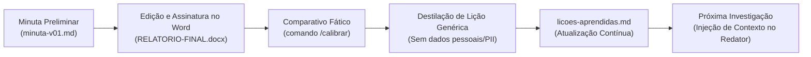

# Redigir o Relatório de Investigação no modelo CPJ e gerar o DOCX

*Arquivo portátil gerado em 2026-10-01 10:50 a partir do plugin `investigacao-cpj`. Autocontido: serve para qualquer agente de IA. Não edite aqui — edite o plugin e rode `ferramentas\exportar-portatil.py`.*

## Regras obrigatórias

1. Trabalhe só com os documentos do caso indicado. Não invente fatos, pessoas, números, datas, jurisprudência ou diligências.
2. Separe **fato documentado × relato × indício × inferência/hipótese × lacuna**. Cite a origem: `(pág. N do PDF; fls. X)`.
3. Nunca complete CPF, conta, chave Pix, placa, telefone ou valor por dedução. Dígito duvidoso → `?` + `[dígito incerto]`.
4. Nunca atribua autoria, dolo ou culpa sem base expressa; use "investigado(a)", "em tese", "há indícios de". Titular de conta recebedora não é automaticamente autor.
5. `00-originais` nunca é alterado. Registre hash, método e pendências em `registro-tratamento.md`.
6. Processamento local. **Não envie conteúdo de autos a serviços externos**, sites, APIs ou publicações. Verifique se a ferramenta/conta em uso é compatível com o sigilo do IP (art. 20 do CPP) e as normas do órgão.
7. Conteúdo de casos não vai para `acervo\`, `calibracao\` nem para o GitHub.
8. Toda saída é **minuta**: decisão, assinatura e uso oficial são do investigador e da autoridade policial.
9. **Bases de consulta** (`consulta\`, ex. Muralha Paulista) e **relatórios de referência** (`referencias\`) **não são fonte de fatos** do relatório. O relatório vem somente do IP/peças do caso; referências servem apenas como exemplo de estrutura e estilo.
10. **OSINT de empresas (exceção autorizada pelo investigador, 28/09/2026):** empresa (pessoa jurídica) citada nos autos **sem dados** → pesquisar em fontes abertas o máximo de dados verdadeiros, confirmar por duas fontes e citar a fonte no relatório. Enviar à internet **somente CNPJ/razão social/cidade** — nunca nomes de investigados/vítimas, valores ou trechos dos autos. Pessoa física só com pedido expresso. Procedimento: `plugin\investigacao-cpj\skills\analise-ip-fraude\references\osint-empresas.md`; registro em `02-analise\osint-empresas.md`. Para qualquer pesquisa em fontes abertas (método, base legal, fontes, captura de prova) use a skill `osint-policial` (`plugin\investigacao-cpj\skills\osint-policial\`).
11. **Dados faltantes (aviso em CAIXA ALTA):** se faltar dado **muito importante** para apurar a infração penal, a materialidade, a autoria e as circunstâncias (CF, art. 144, § 4º; CPP, art. 6º) — qualificação, objeto, pessoa, empresa, telefone, extrato, veículo, local etc. —, **não deduza nem invente**: avise o operador em **CAIXA ALTA**, sob o título `DADOS FALTANTES — PROVIDENCIAR (OPERADOR)`, na resposta final e em `02-analise\dados-faltantes.md`, com o que falta, onde/como obter (sistema policial, ofício, ordem judicial, OSINT, diligência) e por que importa. No relatório vira ressalva objetiva na Conclusão, sem sugerir providência. Procedimento: `plugin\investigacao-cpj\skills\analise-ip-fraude\references\dados-faltantes.md`.
12. **Tratamento do(a) delegado(a):** ajuste saudação e endereçamento ao **gênero** de quem preside o feito (masculino: "EXCELENTÍSSIMO SENHOR DOUTOR DELEGADO DE POLÍCIA" e, ao final, "Ao Excelentíssimo Sr. Dr. / NOME / Delegado de Polícia / Central de Polícia Judiciária"; feminino: "EXCELENTÍSSIMA SENHORA DOUTORA DELEGADA DE POLÍCIA" e "À Excelentíssima Sra. Dra. / NOME / Delegada de Polícia / Central de Polícia Judiciária"). Descubra o gênero nos documentos do caso (ex.: "Dr."/"Dra." nas conclusões, "o/a Delegado/a"); **não infira pelo nome**. Sem base, pergunte ao operador e avise em CAIXA ALTA. Na minuta use `delegado_genero: M` ou `F`.
13. **Estilo e formatação do relatório (mão do investigador):** texto **corrido**, jurídico, objetivo e humano; **sem tópicos, marcadores, negritos de abertura e listas** no corpo (evita aparência de texto gerado por IA); tabela só para a planilha do caminho do dinheiro, quando necessária. **Resumo dos fatos** compacto: a dinâmica do golpe e, sobretudo, os **valores movimentados**. Fls. só em pontos de muita relevância e dados financeiros. Conclusão breve, sem sugestões de providência salvo pedido.
    - **Nomes de pessoas e empresas:** sempre em **NEGRITO E CAIXA ALTA** (ex.: `**JOÃO DA SILVA**`, `**BANCO BRADESCO S.A.**`).
    - **Demais informações importantes:** destacadas em negrito normal (`**dado**`).
    - **Informações super relevantes:** grifadas de amarelo (use a marcação `==texto super relevante==`).
    - **Informações que o investigador deva obter ou preencher manualmente:** escritas em **CAIXA ALTA E EM VERMELHO** para alertar (use `[PESQUISAR: DADO EM CAIXA ALTA]`, `[OBTER: ...]`, `{PREENCHER: ...}`). O gerador DOCX automaticamente aplica a cor vermelha e caixa alta.

14. **Um agente por Ordem de Serviço:** antes de extrair, analisar ou redigir qualquer O.S. de `E:\ORDENS DE SERVIÇO CPJ`, rode `python ferramentas\fila-os.py listar` e reserve com `assumir <nº> --agente <nome>` (ou `proxima --agente <nome>`). Não pegue O.S. `em_andamento` de outro agente nem refaça O.S. `concluida`/`com_relatorio` sem pedido expresso do investigador. Workspace canônico dos casos: `casos`. Ao terminar, `concluir <nº> --agente <nome> --docx "<caminho>"` e copie o DOCX final para a pasta da O.S.; se parar, `liberar ... --motivo "<onde parou>"`. A reserva vence em 4 h sem `renovar`. Quadro: `E:\ORDENS DE SERVIÇO CPJ\_CONTROLE-OS.md`.

15. **Numeração do procedimento no cabeçalho (determinação do delegado, 30/09/2026):** no campo **Referência:** e nas informações do procedimento na parte superior do relatório de inquérito policial, use **EXCLUSIVAMENTE o número do Inquérito Policial Eletrônico (IPe) e do Processo Judicial** (ex.: `Referência: IPe nº <número> / Processo nº <número>`). **NÃO coloque o número do Boletim de Ocorrência (BO)** e **NÃO coloque o número do IP local (físico/delegacia de origem)**. Esta regra é mandatória para todos os relatórios elaborados a partir de 30/09/2026.

Governança completa: `acervo\repo-ia-alandougs\governanca\seguranca-e-dados.md`.

## Como usar fora do Claude Code

- Onde estiver `/comando`, siga o texto daquele comando abaixo. Onde disser "skill X" ou "agente X", as instruções estão neste arquivo ou em `portatil\`.
- Scripts Python ficam em `plugin\investigacao-cpj\skills\<skill>\scripts\` (PowerShell, `python`). Sem execução de comandos, peça ao usuário para rodá-los.
- Sem subagentes: execute as etapas em sequência.

## Fonte: `plugin/investigacao-cpj/commands/relatorio-ip.md`

> Redige a minuta do Relatório de Investigação no modelo CPJ, revisa contra as fontes e gera o DOCX com timbre e assinatura

Elabore o relatório do caso: [ARGUMENTOS: informe o ID do caso (ex.: OS-123-2026) e observações]

Use a skill `relatorio-ip-fraude`.

1. Leia `calibracao\licoes-aprendidas.md`, `modelos\dados-padrao.json`, a análise do caso (`02-analise\`) e exemplos da mesma modalidade por autor e peso (`rag.py exemplos <modalidade> --autor "<investigador>" -n 3` — FINAL do sistema + referências importadas; só estilo/estrutura, nunca fatos). Fatos: somente os documentos do caso; bases de consulta não são fonte.
2. Se o investigador informou diligências próprias (consultas a sistemas, oitivas, campana), inclua **somente** o que ele informou. Se faltar dado do cabeçalho (O.S., delegado destinatário), use `{...}` e liste. No cabeçalho (campo `referencia` / dados do procedimento), siga a **determinação do Delegado (30/09/2026)**: use **SOMENTE o número do IPe (Inquérito Policial Eletrônico) e do Processo Judicial** (ex.: `IPe nº ... / Processo nº ...`); **NUNCA coloque número de BO nem IP local**. Defina `delegado_genero: M|F` pelos documentos do caso (Dr./Dra., "o/a Delegado/a"); não infira pelo nome; sem base, pergunte. Redija em **texto corrido**, sem tópicos; Resumo dos fatos compacto, com a dinâmica e os valores movimentados (AGENTS.md §1.12-1.13, §1.15).
2a. **Dados faltantes:** se faltar dado muito importante para autoria, materialidade ou circunstâncias, grave `02-analise\dados-faltantes.md` e avise o operador **em CAIXA ALTA** na resposta final (`DADOS FALTANTES — PROVIDENCIAR (OPERADOR)`), conforme `skills\analise-ip-fraude\references\dados-faltantes.md`. Não deduza; no relatório, só ressalva objetiva na Conclusão.
3. Grave `03-relatorios\minuta-vNN.md` e `rastreabilidade-vNN.md`; `caso.py status <ID> minuta`.
4. execute as instruções do agente `revisor-de-relatorio` (seção neste arquivo ou em portatil\) → `revisao-vNN.md`. Corrija erros objetivos na minuta (mesma versão) e liste o que depende de decisão.
5. Gere o DOCX (rascunho): `python "plugin\investigacao-cpj\skills\relatorio-ip-fraude\scripts\gerar_docx.py" "<minuta>" --saida "casos\<ID>\03-relatorios\RELATORIO-<ID>-vNN.docx"`.
6. Apresente: caminho do DOCX, resumo da revisão, campos pendentes, dados críticos não conferidos e, **em CAIXA ALTA, os DADOS FALTANTES para o operador providenciar**. Diga que, após revisar/editar no Word e entregar, basta rodar `/entregar <ID>`.

## Fonte: `plugin/investigacao-cpj/skills/relatorio-ip-fraude/SKILL.md`

> Redige o Relatório de Investigação no modelo oficial da CPJ (timbre SSP/PCSP, DEINTER 8, Seccional de Presidente Prudente) para inquéritos de fraude e estelionato, a partir da análise rastreável do caso - minuta Markdown com rastreabilidade por página, revisão, e geração do DOCX com timbre, dados do procedimento e assinatura. Use quando o usuário pedir "faz o relatório", "relatório de investigação do IP", "minuta do relatório", "gera o docx", "relatório para o delegado" em caso de estelionato, golpe, fraude eletrônica ou Pix.

## Relatório de Investigação — IP de fraude/estelionato (modelo CPJ)

Produz a minuta do relatório **sobre a análise já feita** (`02-analise\`), nunca direto do PDF bruto. Estilo e estrutura seguem o **modelo DOCX do investigador** (`modelos\MODELO RELATORIO DE INVESTIGACAO - CPJ 2026.docx`) e o "Modelo Alan" da skill `relatorio-investigacao-policial` (método PTCFREE). Onde divergirem, **prevalece o modelo DOCX**.

### Antes de redigir (obrigatório)

1. Leia `calibracao\licoes-aprendidas.md` e aplique cada lição.
2. Leia `references\modelo-cpj.md` (estrutura e regras extraídas do modelo DOCX).
3. **Exemplos (estilo e estrutura, nunca fatos):** `python "<scripts da base-cpj>\rag.py" exemplos <modalidade> --autor "<investigador de dados-padrao.json>" -n 3`. A lista junta relatórios `-FINAL` do sistema e **referências importadas** (`referencias\`, relatórios anteriores do investigador ou de colegas), ordenadas por mesma modalidade → autor preferido → **peso** (5 = modelo exemplar … 1 = usar com reservas). Use 1–2, preferindo peso ≥ 4 e o próprio autor; com peso ≤ 2, aproveite só a estrutura. Se o índice estiver vazio, procure `casos\*\03-relatorios\*-FINAL.md` da mesma `modalidade`. Nunca transporte nomes, números, datas ou conclusões de um exemplo para a minuta.
4. Confirme que existem `02-analise\ficha-caso.md`, `cronologia.md`, `fluxo-financeiro.md/.csv`, `matriz-achados.md`. Se faltarem, rode antes a skill `analise-ip-fraude` (ou avise e produza com ressalvas, se o usuário quiser).
5. Leia a Ordem de Serviço / determinação (escopo). O relatório responde ao que foi pedido.
6. Carregue `modelos\dados-padrao.json` (investigador, unidade, cidade, delegado padrão).
7. **Fonte dos fatos = somente os documentos do próprio caso** (IP e peças enviadas, via `02-analise\`). Bases de consulta (`consulta\`, ex.: Muralha Paulista) servem apenas para o investigador pesquisar; o que vier delas só entra no relatório se o investigador informar que fez a consulta (sistema, data, resultado) — e então como diligência dele, citada assim.
8. **Dados do procedimento:** Sempre insira o nome do escrivão/escrivã e do Delegado de Polícia nos dados do procedimento/cabeçalho ou no início do relatório, conforme orientação do investigador.
9. **Numeração no cabeçalho (determinação do delegado, 30/09/2026):** no campo `referencia` e na identificação do procedimento no topo do relatório, use **EXCLUSIVAMENTE o número do Inquérito Policial Eletrônico (IPe) e do Processo Judicial** (ex.: `IPe nº <número> / Processo nº <número>`). **NUNCA coloque o número do Boletim de Ocorrência (BO)** e **NUNCA coloque o número do IP local (físico/delegacia de origem)**. Esta regra é mandatória para todos os relatórios elaborados daqui para frente.

**Progresso:** se o pedido veio de botão da Central CPJ, informe os marcos (análise e exemplos lidos, minuta, rastreabilidade, revisão, DOCX) com `agente-plantao.py progresso` (agente de plantão em chat; parar se responder CANCELADO) ou `progresso.py <ID> <N> "<etapa>"` (executor automático). Em uso interativo, não é necessário.

### Esquio PTCFREE (interno, não exibir)

- **P:** Investigador de Polícia Alan Douglas Silva, CPJ Presidente Prudente, atuando por Ordem de Serviço do Delegado.
- **T:** Relatório de investigação do IP/BO indicado.
- **C:** fraude/estelionato; modalidade; diligências e análises efetivamente realizadas (consultas, análise dos autos, extratos, comprovantes).
- **F:** modelo CPJ (abaixo).
- **R:** sem invenção; sem atribuição de culpa; fato × relato × indício × conclusão; placeholders `{...}` para o que faltar.
- **E:** relatórios `-FINAL` anteriores e referências importadas (por autor e peso) + lições de calibração.
- **S:** objetivo, direto, institucional, primeira pessoa discreta ("venho apresentar", "foi realizada análise"), sem retórica.

### Estrutura da minuta (`03-relatorios\minuta-vNN.md`)

```markdown
---
caso: <ID>
versao: NN
gerado_em: AAAA-MM-DD
ordem_servico: ...
referencia: IPe nº <número> / Processo nº <número>   # DETERMINAÇÃO DO DELEGADO (30/09/2026): SOMENTE IPe e Processo Judicial; NUNCA colocar número de BO nem IP local
natureza: Estelionato ...      # como consta nos autos
investigados: ...              # nomes como constam; "não identificado(s)" se for o caso
vitimas: ...
local: ...
data_fatos: DD/MM/AAAA
local_data: Presidente Prudente, SP, <data por extenso>
data_rodape: DD/MM/AAAA
delegado: <NOME do(a) delegado(a) destinatário(a), sem "Dr.">
delegado_genero: M             # M ou F, conforme os documentos do caso (Dr./Dra.); NÃO inferir pelo nome; sem base, perguntar ao operador
---

### RESUMO DOS FATOS
### DILIGÊNCIAS REALIZADAS
### CONCLUSÃO
```

Os campos do cabeçalho e as três seções são exatamente os lidos pelo `scripts\gerar_docx.py`. O título, saudação, fecho, assinatura e destinatário já estão no modelo DOCX — **não repita** no corpo.

#### Conteúdo das seções (regras do modelo CPJ)

- **RESUMO DOS FATOS:** compacto, enxuto, objetivo e lógico: a **dinâmica dos fatos** (como a vítima foi induzida, por qual meio, para quem pagou) e, sobretudo, os **valores movimentados** (quanto, quando, para onde seguiu, quanto chegou ao destino), em linguagem cautelosa ("consta do boletim de ocorrência que...", "em tese"); em seguida, o que a Ordem de Serviço determinou. 1–2 parágrafos, **texto corrido**.
- **DILIGÊNCIAS REALIZADAS** (**texto corrido**, sem tópicos, marcadores nem negritos de abertura; tabela só para a planilha do caminho do dinheiro): o que foi feito e o que se obteve, em ordem lógica/cronológica. Inclua, conforme o caso:
  - análise dos autos e documentos (quais, com fls.);
  - qualificação das pessoas relevantes (nome, RG, CPF, filiação, naturalidade, endereços, telefones) **somente como constam nos autos/consultas realizadas**;
  - **caminho do dinheiro**: vítima → conta(s) de passagem → destinatário, com datas, valores, bancos, chaves Pix e IDs de transação, citando fls.;
  - **planilha** (tabela Markdown) quando necessária para demonstrar a dinâmica financeira — ela vira tabela no DOCX;
  - cruzamento de dados (mesmo telefone/conta/endereço entre pessoas) e identificação de **supostos** autores, com base indicada;
  - descrição objetiva de fotos/vídeos/prints, se houver.
  Não inclua diligência que não foi realizada. Consultas a sistemas só se o usuário informar que as fez (sistema, data, resultado).
- **CONCLUSÃO:** breve descrição do resultado (o que foi apurado, o que não foi possível e por quê; indícios de autoria/materialidade em linguagem condicional). **Sugestões de providências: por padrão, NÃO sugerir** — o modelo determina ponderar e preferir deixar à discricionariedade do delegado. Só inclua sugestão se o usuário pedir ou se for claramente cabível e delimitada à Ordem de Serviço; nesse caso, uma frase, sinalizando quando depende de autorização judicial (ex.: afastamento de sigilo bancário/fiscal, busca e apreensão).

#### Estilo (mão do investigador) e tratamento

- **Texto corrido**, voz do investigador (primeira pessoa discreta, direta, jurídica e humana). Sem tópicos, listas, negritos de abertura ("**Claudia (Inter).**") ou frases paralelas em série, para que o texto não pareça gerado por IA. Frases variadas, sem jargão desnecessário, sem adjetivação.
- **Delegado(a):** o modelo DOCX traz "(A)" nas flexões; `gerar_docx.py` corrige saudação e endereçamento final pelo campo `delegado_genero` (M: "EXCELENTÍSSIMO SENHOR DOUTOR DELEGADO DE POLÍCIA," e "Ao Excelentíssimo Sr. Dr. / NOME / Delegado de Polícia / Central de Polícia Judiciária"; F: "EXCELENTÍSSIMA SENHORA DOUTORA DELEGADA DE POLÍCIA," e "À Excelentíssima Sra. Dra. / NOME / Delegada de Polícia / Central de Polícia Judiciária"). Descubra o gênero nos documentos do caso; não infira pelo nome.
- **Formatação de texto no DOCX (Regra mandatória do investigador):**
  - **Nomes de pessoas e empresas:** sempre em **NEGRITO E CAIXA ALTA** (ex.: `**JOÃO DA SILVA**`, `**BANCO BRADESCO S.A.**`).
  - **Demais informações importantes:** destacadas em negrito normal (`**dado**`).
  - **Informações super relevantes:** grifadas de amarelo (use a marcação `==texto super relevante==`).
  - **Informações que o investigador deva obter ou preencher manualmente:** escritas em **CAIXA ALTA E EM VERMELHO** para alertar (use a marcação `[PESQUISAR: QUALIFICAÇÃO COMPLETA]`, `[OBTER: COMPROVANTE]`, `{PREENCHER: DADO EM FALTA}`).

#### Citações

- No texto do relatório, cite **fls. dos autos** só em pontos de muita relevância e nos dados financeiros: `(fls. 45)`. Sem fls., use `(pág. 45 do arquivo)` e marque a pendência. A rastreabilidade completa fica em `rastreabilidade-vNN.md`, não no texto.
- Gere junto `03-relatorios\rastreabilidade-vNN.md`: `| trecho do relatório | fonte (pág./fls.) | natureza | conferido? |` para cada afirmação material.

### Fluxo

1. Minuta `minuta-vNN.md` + `rastreabilidade-vNN.md` (NN = próxima versão livre). `caso.py status <ID> minuta`.
2. Revisão pelo agente `revisor-de-relatorio` → `revisao-vNN.md` (sustentada/parcial/não localizada/contraditória). Corrija o que for erro objetivo; leve ao usuário o que depender de decisão.
3. Mostre ao usuário: resumo, pendências (`{...}`), dados críticos não conferidos.
4. Com a aprovação do usuário, gere o DOCX:

```powershell
python "plugin\investigacao-cpj\skills\<skill>\scripts\gerar_docx.py" "casos\<ID>\03-relatorios\minuta-vNN.md" --saida "casos\<ID>\03-relatorios\RELATORIO-<ID>-vNN.docx"
## rascunho sem assinatura: acrescente --sem-assinatura
```

O script preserva timbre, rodapé (paginação automática) e assinatura do modelo, atualiza a data do rodapé e lista campos que ficaram com texto-guia.
5. Quando o usuário disser que o relatório foi entregue/finalizado: copie a versão final para `RELATORIO-<ID>-FINAL.md` (e, se ele editou o DOCX, extraia o texto do DOCX final para esse `.md`), rode `caso.py relatorio <ID> ...` e `caso.py status <ID> entregue` (skill `base-cpj`) e sugira `/calibrar <ID>`.

### Nunca

- Inventar fatos, fls., qualificação, diligências, consultas, números de procedimento ou dispositivos legais.
- "Criminoso", "autor comprovado", "golpista", "culpado". Use "investigado(a)", "titular da conta destinatária", "suposto autor".
- Afirmar quebra de sigilo, medida cautelar ou consulta que não conste como realizada/autorizada.
- Levar dado crítico não conferido à conclusão sem marcá-lo.
- Usar base de consulta (`consulta\`) ou relatório de referência/exemplo como fonte de fato, qualificação ou antecedente.

## Fonte: `plugin/investigacao-cpj/skills/relatorio-ip-fraude/references/modelo-cpj.md`

## Modelo CPJ 2026 — estrutura extraída do DOCX do investigador

Fonte: `modelos\MODELO RELATORIO DE INVESTIGACAO - CPJ 2026.docx` (A4, margens 2 cm, Arial 12, justificado).

### Cabeçalho (timbre — preservado pelo gerador)

Brasão + tabela: SECRETARIA DA SEGURANÇA PÚBLICA / POLÍCIA CIVIL DO ESTADO DE SÃO PAULO / Departamento de Polícia Judiciária de São Paulo Interior 8 – DEINTER 8 / Delegacia Seccional de Polícia de Presidente Prudente / Central de Polícia Judiciária.

### Rodapé (preservado)

Endereço e telefones da CPJ; data (texto fixo, atualizado por `data_rodape`); "Página X de Y" (campos automáticos).

### Corpo

| Ordem | Elemento | Formato | Campo da minuta |
|---|---|---|---|
| 1 | RELATÓRIO DE INVESTIGAÇÃO | centralizado, negrito, 16 pt | — |
| 2 | Ordem de Serviço: … | negrito | `ordem_servico` |
| 3 | Referência: IPe nº <número> / Processo nº <número> (DETERMINAÇÃO DO DELEGADO, 30/09/2026: SOMENTE o número do Inquérito Policial Eletrônico e do Processo Judicial; NUNCA colocar BO nem IP local) | negrito | `referencia` |
| 4 | Natureza: {tipificação que constar nos autos} | negrito | `natureza` |
| 5 | Investigado (s): … | negrito | `investigados` |
| 6 | Vítima(s): … | negrito | `vitimas` |
| 7 | Local: {endereço dos fatos} | negrito | `local` |
| 8 | Data dos Fatos: … | negrito | `data_fatos` |
| 9 | EXCELENTÍSSIMO (A) SENHOR (A) DOUTOR (A) DELEGADO (A) DE POLÍCIA, — ajustado pelo gênero: **M** "EXCELENTÍSSIMO SENHOR DOUTOR DELEGADO DE POLÍCIA,"; **F** "EXCELENTÍSSIMA SENHORA DOUTORA DELEGADA DE POLÍCIA," | negrito | `delegado_genero` |
| 10 | Cumprimento respeitosamente Vossa Excelência e venho apresentar este relatório de investigação, conforme segue: | — | — |
| 11 | **RESUMO DOS FATOS** | negrito | `## RESUMO DOS FATOS` |
| 12 | **DILIGÊNCIAS REALIZADAS** | negrito | `## DILIGÊNCIAS REALIZADAS` |
| 13 | **CONCLUSÃO** | negrito | `## CONCLUSÃO` |
| 14 | Portanto, submeto o presente relatório… / Era o que me cumpria informar. É o relatório. | — | — |
| 15 | [local, Estado], {data} | à direita | `local_data` |
| 16 | Assinatura (imagem) / Alan Douglas Silva / Investigador de Polícia | centralizado | — |
| 17 | Endereçamento final por gênero — **M** "Ao Excelentíssimo Sr. Dr. / NOME / Delegado de Polícia / Central de Polícia Judiciária"; **F** "À Excelentíssima Sra. Dra. / NOME / Delegada de Polícia / Central de Polícia Judiciária" | negrito | `delegado`, `delegado_genero` |

### Instruções do próprio modelo (normativas para a redação)

- **Resumo dos fatos:** resumir os fatos investigados (BO, autos, IP, quebras de sigilo bancário/fiscal etc.) em **brevíssima síntese**; se declarado, descrever o que foi solicitado na Ordem de Serviço pela autoridade policial.
- **Diligências realizadas:** elencar e descrever as diligências, dados analisados e obtidos; qualificação (nome, RG, CPF, filiação, naturalidade, endereços, telefone); **cruzar dados**; **percorrer o caminho do dinheiro (vítima, conta de passagem, até chegar ao destinatário)**, identificando supostos autores; **elaborar planilha** se necessário à demonstração da dinâmica financeira; analisar e descrever fotos ou vídeos.
- **Conclusão:** breve descrição do resultado. Sugestão de providências **delimitada ao objetivo da Ordem de Serviço e ao escopo da investigação** (ex.: em caso especial e cabível, representação por quebra de sigilo bancário/fiscal do investigado; busca e apreensão domiciliar quando preenchidos os requisitos) — **sempre ponderar; preferível não sugerir, deixando o delegado atuar em sua discricionariedade.**

## Fonte: `plugin/investigacao-cpj/skills/analise-ip-fraude/references/dados-faltantes.md`

## Dados faltantes: como identificar e avisar o operador

**Regra do investigador (28/09/2026), vale para qualquer agente ou LLM** ao analisar, pesquisar ou redigir relatório: se faltar dado **muito importante** para apurar a infração penal, sua **materialidade, autoria e circunstâncias** (CF, art. 144, § 4º; CPP, art. 6º), o agente **não completa, não deduz e não inventa**: **avisa o operador em CAIXA ALTA**, para que ele providencie em sistemas policiais e/ou fora deles (qualificações, objetos, pessoas, empresas, telefones etc.).

### Quando é "muito importante"
Só o que muda a resposta da O.S. ou o rumo da investigação, por exemplo:
- **Autoria:** quem está por trás de conta, telefone, perfil, chave Pix, empresa ou veículo; destinatário final do dinheiro sem qualificação nos autos; nome que aparece em mais de uma cadeia.
- **Materialidade:** comprovante/extrato/imagem/laudo que sustenta o fato e não está nos autos; período do extrato que não cobre o fato; valor divergente sem explicação.
- **Circunstâncias:** local, data/hora, meio (telefone/IP/aparelho), vínculo entre investigados, existência de outros inquéritos ou vítimas.
- **Identificação:** CPF/RG/filiação/endereço/telefone de investigado ou destinatário; homônimo a afastar.
Não avisar por detalhe irrelevante, formalidade sem efeito ou curiosidade.

### Como avisar (formato)
No final da resposta ao operador **e** em `02-analise\dados-faltantes.md`, sob o título exato **DADOS FALTANTES — PROVIDENCIAR (OPERADOR)**, tudo em **CAIXA ALTA**, ordenado por importância, cada item com: **O QUE FALTA — ONDE/COMO OBTER — POR QUE IMPORTA (uma linha)**. Máximo de itens úteis (em regra até 8); sem sugerir medida que é do delegado decidir: indique a **via** (consulta em sistema, ofício, ordem judicial) apenas para orientar o operador.

Exemplo do formato (fictício):
```
DADOS FALTANTES — PROVIDENCIAR (OPERADOR)
1. QUALIFICAÇÃO COMPLETA E ANTECEDENTES DE <NOME/CPF COMO CONSTA> — CONSULTA EM SISTEMAS POLICIAIS — DESTINATÁRIO FINAL DE R$ X SEM QUALIFICAÇÃO NOS AUTOS.
2. EXTRATO DA CONTA <BANCO/AGÊNCIA/CONTA> NO PERÍODO <...> — ORDEM JUDICIAL DE QUEBRA DE SIGILO (NÃO CONSTA DOS AUTOS) — FECHA O CAMINHO DO DINHEIRO.
```

### Onde costuma estar o dado (para orientar o operador)
- **Sistemas policiais/estatais (consulta pelo operador):** antecedentes, mandados, qualificação e endereços de pessoas; titularidade e restrições de veículo; RG/IIRGD; registros de ocorrências/inquéritos; cadastros locais (ex.: Muralha Paulista, INFOSEG/SINESP, Detran/RENAVAM) — **confirmar quais o operador acessa**.
- **Ofício (sem ordem judicial), quando a lei permitir:** dados cadastrais de titular (qualificação, filiação, endereço) a banco, operadora, provedor — Lei 12.850/2013, art. 15 (ver `osint-policial\references\base-legal-e-limites.md`).
- **Ordem judicial (representação):** extratos e movimentação bancária, registros de conexão/acesso e conteúdo, localização/ERB, quebra de sigilo telemático, busca e apreensão.
- **Requerimento cautelar de guarda de registros** ao provedor (Marco Civil, arts. 13, § 2º, e 15, § 2º), com pedido judicial em seguida.
- **Fontes abertas (OSINT):** empresa, sócios, endereço, presença digital, processos públicos, domínio, anúncio (ver skill `osint-policial`).
- **Diligência de campo/oitiva:** local, câmeras, testemunha, comprovantes em posse da vítima, aparelho, prints e conversas originais.
- **Perícia:** exame do aparelho, laudo de imagem/áudio, extração de dados.

### Onde o aviso aparece
1. **Sempre** na resposta final ao operador (em CAIXA ALTA).
2. Em `02-analise\dados-faltantes.md` (mesmo texto).
3. No relatório: **não** vira lista nem sugestão de providência; a lacuna aparece como **ressalva objetiva** na Conclusão ("os autos não trazem…"), em texto corrido. Se o dado faltar no cabeçalho ou em qualificação essencial, use `{...}` e avise em CAIXA ALTA.

## Instantâneo de `calibracao/licoes-aprendidas.md` (versão viva: o próprio arquivo no workspace)

## Lições aprendidas — relatórios de investigação (fraude/estelionato)

Este documento é lido **obrigatoriamente antes** de qualquer análise documental ou redação de minuta de relatório policial.
Contém unicamente **regras genéricas e acionáveis** derivadas da prática cotidiana e das calibragens do investigador de polícia — **sem nomes, números, chaves Pix, contas bancárias ou dados pessoais de casos**.

---

### 1. Ciclo Contínuo de Calibração Fática (Word → Lições Aprendidas)

A governança do sistema estabelece um ciclo fechado de retroalimentação fática contínua:



1. **Geração da Minuta:** O redator oficial gera a minuta inicial no padrão institucional CPJ 2026.
2. **Refinamento Humano:** O Investigador de Polícia revisa, ajusta termos, calibra ênfases fáticas e finaliza o documento no Microsoft Word (`RELATORIO-<ID>-FINAL.docx`).
3. **Extração de Lições:** Pelo comando `/calibrar`, o sistema compara a minuta original gerada pela IA com o documento final assinado pelo investigador, identificando:
   - Supressões de texto prolixo ou excessivo.
   - Ajustes de estilo, terminologia jurídica ou enquadramento.
   - Formatações visuais que necessitaram de correção manual.
4. **Generalização Segura:** O agente ou operador sintetiza o aprendizado em regra genérica e institucional, submete ao crivo do investigador e registra neste arquivo.

---

### 2. Convenções do Ambiente e Metas

- **2026-09-27 · investigador · Padrão de ID de caso:** Padrão canônico `OS-<nº>-<ano>` (ex.: `OS-123-2026`).
- **2026-09-27 · investigador · Meta de produção:** 30 a 50 relatórios/mês (meta de referência 40 em `producao/config.json`); inquéritos policiais típicos de 100 a 300 páginas.
- **2026-09-29 · investigador · Fila de O.S. (1 agente por O.S.):** Reserva obrigatória via `fila-os.py` com expiração de 4 horas; quadro em `_CONTROLE-OS.md`.

---

### 3. Estrutura e Modelo Oficial CPJ 2026

- **2026-09-27 · modelo · Seções obrigatórias:** Cabeçalho formal (O.S., Referência, Natureza, Investigado(s), Vítima(s), Local, Data dos Fatos) + `RESUMO DOS FATOS` + `DILIGÊNCIAS REALIZADAS` + `CONCLUSÃO`. Não criar seções estranhas como "Resultados obtidos" ou "Metodologia"; o desfecho probatório pertence à Conclusão.
- **2026-09-27 · modelo · Resumo dos fatos conciso:** Síntese compacta da dinâmica do golpe e dos **valores totais movimentados**, mencionando expressamente a determinação da Ordem de Serviço, se declarada.
- **2026-09-27 · modelo · Caminho do dinheiro:** Nas diligências, percorrer metodicamente a cadeia financeira (vítima $\rightarrow$ contas de passagem $\rightarrow$ destinatário final), inserindo tabela quando houver múltiplos repasses para facilitar a visualização pela Autoridade Policial e pelo Ministério Público.
- **2026-09-27 · modelo · Conclusão breve e sem juízo de valor invasivo:** Preferir **não sugerir providências cautelares ou representações judiciais** por iniciativa própria; sugerir apenas se expressamente determinado na O.S. ou estritamente delimitado aos elementos colhidos.
- **2026-09-29 · investigador · Dados do procedimento no DOCX:** Sempre identificar expressamente o nome do escrivão/escrivã do feito e a Autoridade Policial (Delegado/Delegada) que preside os autos.
- **2026-09-28 · investigador · Concordância de gênero da autoridade:** Verificar no despacho se a autoridade policial é Delegado ("Dr.") ou Delegada ("Dra."). Ajustar rigorosamente o vocativo e fecho:
  - Masculino: `"EXCELENTÍSSIMO SENHOR DOUTOR DELEGADO DE POLÍCIA"` e `"Ao Excelentíssimo Sr. Dr. ... Delegado de Polícia"`.
  - Feminino: `"EXCELENTÍSSIMA SENHORA DOUTORA DELEGADA DE POLÍCIA"` e `"À Excelentíssima Sra. Dra. ... Delegada de Polícia"`.
  - Nunca presumir pelo prenome: havendo dúvida, consultar a peça inaugural do inquérito.
- **2026-09-30 · determinação do delegado · Numeração do procedimento no cabeçalho (Referência):** Quanto à numeração do procedimento que fica na parte superior do relatório de inquérito policial (campo `Referência:`):
  - **NÃO colocar o número do Boletim de Ocorrência (BO).**
  - **NÃO colocar o número do IP local (físico/delegacia de origem).**
  - **Constar EXCLUSIVAMENTE o número do Inquérito Policial Eletrônico (IPe) e do Processo Judicial.**
  - Padrão obrigatório no cabeçalho: `Referência: IPe nº <número> / Processo nº <número>` (ou `Processo Digital nº <número>`).
  - Esta determinação da autoridade policial é mandatória e aplica-se a todos os relatórios elaborados a partir de 30/09/2026.

---

### 4. Estilo, Redação e Apresentação Visual

- **2026-09-27 · investigador · Redação jurídica humana (mão do investigador):** Texto **corrido**, fluído, formal e sóbrio. **Proibido o uso de marcadores, listas com tópicos, hífens ou negritos de abertura no corpo do texto** — isso evita aparência artificial de texto gerado por IA.
- **2026-09-29 · investigador · Padrão de destaque visual no DOCX (REGRA OBRIGATÓRIA):**
  - **Nomes de pessoas e empresas:** Sempre em **NEGRITO E CAIXA ALTA** (ex.: `**JOÃO DA SILVA**`, `**BANCO BRADESCO S.A.**`).
  - **Informações importantes:** Destacadas em **negrito normal** (`**dado**`).
  - **Informações super relevantes:** Grifadas de amarelo (marca-texto institucional: `==texto super relevante==`).
  - **Dados pendentes que o investigador deva obter ou conferir manualmente:** Escritos em **CAIXA ALTA E EM VERMELHO** (ex.: `[PESQUISAR: QUALIFICAÇÃO DO TITULAR]`, `[OBTER: COMPROVANTE DA AGÊNCIA]`, `{PREENCHER: DATA EXATA}`). O gerador DOCX formata automaticamente em vermelho e maiúsculas.
- **2026-09-27 · redação · Sobriedade probatória:** Tratar as pessoas como "investigado(a)", "vítima", "titular da conta recebedora"; usar "em tese", "há indícios", "conforme consta às fls.". Jamais empregar adjetivações como "golpista", "criminoso", "culpado" ou "estelionatário confesso" sem sentença condenatória transitada em julgado.

---

### 5. Análise Financeira e Reconstituição de Contas

- **2026-09-27 · acervo · Diferenciação entre autoria e conta de passagem:** O titular da conta bancária recebedora do Pix/TED não é automaticamente o autor do crime; deve ser qualificado como "titular da conta destinatária" ou "possível conta de passagem (laranja)".
- **2026-09-28 · investigador · Proibição absoluta de dedução de dados bancários:** Nunca completar dígitos incertos ou incompletos de CPF, agência, conta ou chave Pix por dedução lógica. Indicar o dígito ilegível com `?` e alertar em caixa alta para ofício à instituição financeira.
- **2026-09-29 · investigador · Reconciliação de valores:** O prejuízo alegado pela vítima deve ser sempre confrontado com o prejuízo documentado nos comprovantes de transferência anexados aos autos.

---

### 6. Pesquisa em Fontes Abertas (OSINT Policial)

- **2026-09-28 · investigador · OSINT estrita de Pessoas Jurídicas (Regra 10):** Empresas citadas nos autos sem qualificação completa podem ser pesquisadas em fontes abertas oficiais (Receita Federal / Jucesp / Sintegra) para confirmação de CNPJ, quadro societário e endereço, confirmando por no mínimo duas fontes e citando a origem.
- **2026-09-28 · governança · Sigilo de Pessoas Físicas:** É categoricamente proibido enviar à internet nomes, CPFs ou dados de pessoas físicas citadas nos autos. Pessoas físicas só podem ser pesquisadas com autorização e requisição expressa e fundamentada da autoridade policial.

---

### 7. Erros Recorrentes da IA a Evitar

- Não fundir homônimos: nomes semelhantes sem o mesmo CPF ou filiação documental não podem ser associados no relatório.
- Não ignorar carimbos digitais ao calcular densidade textual de páginas de inquérito escaneadas.
- Não presumir a conclusão do inquérito: toda saída é minuta técnica submetida à decisão da Autoridade Policial.
- Não deixar resíduos de formatação ou marcadores do modelo de redação (como `(A)`, `A(o)`, `{...}`, `[nº...]`) no texto submetido ao Investigador.
