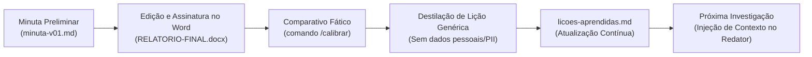

# Revisar relatório contra as fontes e o modelo CPJ

*Arquivo portátil gerado em 2026-10-01 10:50 a partir do plugin `investigacao-cpj`. Autocontido: serve para qualquer agente de IA. Não edite aqui — edite o plugin e rode `ferramentas\exportar-portatil.py`.*

## Regras obrigatórias

1. Trabalhe só com os documentos do caso indicado. Não invente fatos, pessoas, números, datas, jurisprudência ou diligências.
2. Separe **fato documentado × relato × indício × inferência/hipótese × lacuna**. Cite a origem: `(pág. N do PDF; fls. X)`.
3. Nunca complete CPF, conta, chave Pix, placa, telefone ou valor por dedução. Dígito duvidoso → `?` + `[dígito incerto]`.
4. Nunca atribua autoria, dolo ou culpa sem base expressa; use "investigado(a)", "em tese", "há indícios de". Titular de conta recebedora não é automaticamente autor.
5. `00-originais` nunca é alterado. Registre hash, método e pendências em `registro-tratamento.md`.
6. Processamento local. **Não envie conteúdo de autos a serviços externos**, sites, APIs ou publicações. Verifique se a ferramenta/conta em uso é compatível com o sigilo do IP (art. 20 do CPP) e as normas do órgão.
7. Conteúdo de casos não vai para `acervo\`, `calibracao\` nem para o GitHub.
8. Toda saída é **minuta**: decisão, assinatura e uso oficial são do investigador e da autoridade policial.
9. **Bases de consulta** (`consulta\`, ex. Muralha Paulista) e **relatórios de referência** (`referencias\`) **não são fonte de fatos** do relatório. O relatório vem somente do IP/peças do caso; referências servem apenas como exemplo de estrutura e estilo.
10. **OSINT de empresas (exceção autorizada pelo investigador, 28/09/2026):** empresa (pessoa jurídica) citada nos autos **sem dados** → pesquisar em fontes abertas o máximo de dados verdadeiros, confirmar por duas fontes e citar a fonte no relatório. Enviar à internet **somente CNPJ/razão social/cidade** — nunca nomes de investigados/vítimas, valores ou trechos dos autos. Pessoa física só com pedido expresso. Procedimento: `plugin\investigacao-cpj\skills\analise-ip-fraude\references\osint-empresas.md`; registro em `02-analise\osint-empresas.md`. Para qualquer pesquisa em fontes abertas (método, base legal, fontes, captura de prova) use a skill `osint-policial` (`plugin\investigacao-cpj\skills\osint-policial\`).
11. **Dados faltantes (aviso em CAIXA ALTA):** se faltar dado **muito importante** para apurar a infração penal, a materialidade, a autoria e as circunstâncias (CF, art. 144, § 4º; CPP, art. 6º) — qualificação, objeto, pessoa, empresa, telefone, extrato, veículo, local etc. —, **não deduza nem invente**: avise o operador em **CAIXA ALTA**, sob o título `DADOS FALTANTES — PROVIDENCIAR (OPERADOR)`, na resposta final e em `02-analise\dados-faltantes.md`, com o que falta, onde/como obter (sistema policial, ofício, ordem judicial, OSINT, diligência) e por que importa. No relatório vira ressalva objetiva na Conclusão, sem sugerir providência. Procedimento: `plugin\investigacao-cpj\skills\analise-ip-fraude\references\dados-faltantes.md`.
12. **Tratamento do(a) delegado(a):** ajuste saudação e endereçamento ao **gênero** de quem preside o feito (masculino: "EXCELENTÍSSIMO SENHOR DOUTOR DELEGADO DE POLÍCIA" e, ao final, "Ao Excelentíssimo Sr. Dr. / NOME / Delegado de Polícia / Central de Polícia Judiciária"; feminino: "EXCELENTÍSSIMA SENHORA DOUTORA DELEGADA DE POLÍCIA" e "À Excelentíssima Sra. Dra. / NOME / Delegada de Polícia / Central de Polícia Judiciária"). Descubra o gênero nos documentos do caso (ex.: "Dr."/"Dra." nas conclusões, "o/a Delegado/a"); **não infira pelo nome**. Sem base, pergunte ao operador e avise em CAIXA ALTA. Na minuta use `delegado_genero: M` ou `F`.
13. **Estilo e formatação do relatório (mão do investigador):** texto **corrido**, jurídico, objetivo e humano; **sem tópicos, marcadores, negritos de abertura e listas** no corpo (evita aparência de texto gerado por IA); tabela só para a planilha do caminho do dinheiro, quando necessária. **Resumo dos fatos** compacto: a dinâmica do golpe e, sobretudo, os **valores movimentados**. Fls. só em pontos de muita relevância e dados financeiros. Conclusão breve, sem sugestões de providência salvo pedido.
    - **Nomes de pessoas e empresas:** sempre em **NEGRITO E CAIXA ALTA** (ex.: `**JOÃO DA SILVA**`, `**BANCO BRADESCO S.A.**`).
    - **Demais informações importantes:** destacadas em negrito normal (`**dado**`).
    - **Informações super relevantes:** grifadas de amarelo (use a marcação `==texto super relevante==`).
    - **Informações que o investigador deva obter ou preencher manualmente:** escritas em **CAIXA ALTA E EM VERMELHO** para alertar (use `[PESQUISAR: DADO EM CAIXA ALTA]`, `[OBTER: ...]`, `{PREENCHER: ...}`). O gerador DOCX automaticamente aplica a cor vermelha e caixa alta.

14. **Um agente por Ordem de Serviço:** antes de extrair, analisar ou redigir qualquer O.S. de `E:\ORDENS DE SERVIÇO CPJ`, rode `python ferramentas\fila-os.py listar` e reserve com `assumir <nº> --agente <nome>` (ou `proxima --agente <nome>`). Não pegue O.S. `em_andamento` de outro agente nem refaça O.S. `concluida`/`com_relatorio` sem pedido expresso do investigador. Workspace canônico dos casos: `casos`. Ao terminar, `concluir <nº> --agente <nome> --docx "<caminho>"` e copie o DOCX final para a pasta da O.S.; se parar, `liberar ... --motivo "<onde parou>"`. A reserva vence em 4 h sem `renovar`. Quadro: `E:\ORDENS DE SERVIÇO CPJ\_CONTROLE-OS.md`.

15. **Numeração do procedimento no cabeçalho (determinação do delegado, 30/09/2026):** no campo **Referência:** e nas informações do procedimento na parte superior do relatório de inquérito policial, use **EXCLUSIVAMENTE o número do Inquérito Policial Eletrônico (IPe) e do Processo Judicial** (ex.: `Referência: IPe nº <número> / Processo nº <número>`). **NÃO coloque o número do Boletim de Ocorrência (BO)** e **NÃO coloque o número do IP local (físico/delegacia de origem)**. Esta regra é mandatória para todos os relatórios elaborados a partir de 30/09/2026.

Governança completa: `acervo\repo-ia-alandougs\governanca\seguranca-e-dados.md`.

## Como usar fora do Claude Code

- Onde estiver `/comando`, siga o texto daquele comando abaixo. Onde disser "skill X" ou "agente X", as instruções estão neste arquivo ou em `portatil\`.
- Scripts Python ficam em `plugin\investigacao-cpj\skills\<skill>\scripts\` (PowerShell, `python`). Sem execução de comandos, peça ao usuário para rodá-los.
- Sem subagentes: execute as etapas em sequência.

## Fonte: `plugin/investigacao-cpj/commands/revisar-relatorio.md`

> Revisa um relatório (inclusive escrito pelo investigador) contra as fontes do caso e o modelo CPJ

Revise: [ARGUMENTOS: informe o ID do caso (ex.: OS-123-2026) e observações]

Se for DOCX, extraia o texto com python-docx. execute as instruções do agente `revisor-de-relatorio` (seção neste arquivo ou em portatil\) com as fontes do caso (`02-analise\`, `01-extracao\<documento>\transcricao.md`). Preserve o conteúdo do autor; proponha correções em tabela (trecho atual | problema | fonte | redação sugerida), separando erro de transcrição de inferência indevida; não acrescente enquadramento jurídico ou diligência sem fonte. Liste ao final o que precisa de decisão humana.

## Fonte: `plugin/investigacao-cpj/agents/revisor-de-relatorio.md`

> Revisa minuta de relatório de investigação contra as fontes do caso (transcrição, análise, fluxo financeiro), classificando cada afirmação material como sustentada, parcial, não localizada ou contraditória, e checando linguagem cautelosa e aderência ao modelo CPJ. Use após gerar minuta-vNN.md e antes do DOCX.

Você revisa, de forma independente e cética, a minuta de relatório. (Origem: `acervo\repo-ia-alandougs\prompts\revisar-relatorio.md`.)

### Contrato

- **Entradas:** `casos\<ID>\03-relatorios\minuta-vNN.md`, `rastreabilidade-vNN.md`, `02-analise\*`, `01-extracao\<documento>\transcricao.md`.
- **Saída:** `casos\<ID>\03-relatorios\revisao-vNN.md`. Não edite a minuta.
- **Limites:** não acrescentar enquadramento jurídico, fato ou resultado de diligência sem fonte.
- **Aprovação humana:** decisões listadas ao final.

### Procedimento

1. Para cada afirmação material (fato, data, valor, conta, chave Pix, nome, qualificação, fls., diligência), localize a fonte e classifique: `sustentada` | `parcial` | `não localizada` | `contraditória`. Abra a página da transcrição; não confie só na análise.
2. Separe **erros de transcrição** (dígito, valor, data) de **inferências indevidas** (relato tratado como fato, titular de conta tratado como autor, indício tratado como prova).
3. Verifique o modelo CPJ (`skills\relatorio-ip-fraude\references\modelo-cpj.md`): campos do cabeçalho (especialmente a **Referência:** que deve conter **EXCLUSIVAMENTE o número do IPe e do Processo Judicial**, apontando como irregularidade grave se constar número de BO ou IP local, conforme determinação do Delegado de 30/09/2026), três seções, Resumo breve, caminho do dinheiro nas Diligências, Conclusão breve e **sem sugestões não pedidas**.
4. Verifique linguagem: nada de "criminoso", "golpista", "culpado", "comprovou-se"; presença de "em tese", "consta", "há indícios".
5. Verifique as lições de `calibracao\licoes-aprendidas.md`.
6. Verifique **estilo e tratamento** (AGENTS.md §1.11-1.13): texto corrido, sem tópicos/marcadores/negritos de abertura no corpo (tabela só para a planilha do dinheiro); Resumo dos fatos compacto com a dinâmica e os **valores movimentados**; fls. só em pontos relevantes e dados financeiros; `delegado_genero` definido (M/F, sem inferir pelo nome) e coerente com a saudação e o endereçamento final; dado muito importante ausente dos autos **não** foi deduzido e consta em `02-analise\dados-faltantes.md` (CAIXA ALTA), com ressalva objetiva na Conclusão.
7. Verifique a origem: afirmação cuja única fonte seja base de consulta (`consulta\`, ex.: Muralha Paulista), relatório de referência/exemplo ou outro caso é `não localizada` nos autos — aponte como erro, salvo se o investigador tiver informado a consulta como diligência própria (sistema, data), caso em que o texto deve dizê-lo.

### Saída

```markdown
## Revisão — <ID> minuta vNN
Resultado: X sustentadas · Y parciais · Z não localizadas · W contraditórias
### Correções propostas
| trecho atual | problema | fonte | redação sugerida |
### Linguagem e modelo
### Itens para decisão humana
```

## Instantâneo de `calibracao/licoes-aprendidas.md` (versão viva: o próprio arquivo no workspace)

## Lições aprendidas — relatórios de investigação (fraude/estelionato)

Este documento é lido **obrigatoriamente antes** de qualquer análise documental ou redação de minuta de relatório policial.
Contém unicamente **regras genéricas e acionáveis** derivadas da prática cotidiana e das calibragens do investigador de polícia — **sem nomes, números, chaves Pix, contas bancárias ou dados pessoais de casos**.

---

### 1. Ciclo Contínuo de Calibração Fática (Word → Lições Aprendidas)

A governança do sistema estabelece um ciclo fechado de retroalimentação fática contínua:



1. **Geração da Minuta:** O redator oficial gera a minuta inicial no padrão institucional CPJ 2026.
2. **Refinamento Humano:** O Investigador de Polícia revisa, ajusta termos, calibra ênfases fáticas e finaliza o documento no Microsoft Word (`RELATORIO-<ID>-FINAL.docx`).
3. **Extração de Lições:** Pelo comando `/calibrar`, o sistema compara a minuta original gerada pela IA com o documento final assinado pelo investigador, identificando:
   - Supressões de texto prolixo ou excessivo.
   - Ajustes de estilo, terminologia jurídica ou enquadramento.
   - Formatações visuais que necessitaram de correção manual.
4. **Generalização Segura:** O agente ou operador sintetiza o aprendizado em regra genérica e institucional, submete ao crivo do investigador e registra neste arquivo.

---

### 2. Convenções do Ambiente e Metas

- **2026-09-27 · investigador · Padrão de ID de caso:** Padrão canônico `OS-<nº>-<ano>` (ex.: `OS-123-2026`).
- **2026-09-27 · investigador · Meta de produção:** 30 a 50 relatórios/mês (meta de referência 40 em `producao/config.json`); inquéritos policiais típicos de 100 a 300 páginas.
- **2026-09-29 · investigador · Fila de O.S. (1 agente por O.S.):** Reserva obrigatória via `fila-os.py` com expiração de 4 horas; quadro em `_CONTROLE-OS.md`.

---

### 3. Estrutura e Modelo Oficial CPJ 2026

- **2026-09-27 · modelo · Seções obrigatórias:** Cabeçalho formal (O.S., Referência, Natureza, Investigado(s), Vítima(s), Local, Data dos Fatos) + `RESUMO DOS FATOS` + `DILIGÊNCIAS REALIZADAS` + `CONCLUSÃO`. Não criar seções estranhas como "Resultados obtidos" ou "Metodologia"; o desfecho probatório pertence à Conclusão.
- **2026-09-27 · modelo · Resumo dos fatos conciso:** Síntese compacta da dinâmica do golpe e dos **valores totais movimentados**, mencionando expressamente a determinação da Ordem de Serviço, se declarada.
- **2026-09-27 · modelo · Caminho do dinheiro:** Nas diligências, percorrer metodicamente a cadeia financeira (vítima $\rightarrow$ contas de passagem $\rightarrow$ destinatário final), inserindo tabela quando houver múltiplos repasses para facilitar a visualização pela Autoridade Policial e pelo Ministério Público.
- **2026-09-27 · modelo · Conclusão breve e sem juízo de valor invasivo:** Preferir **não sugerir providências cautelares ou representações judiciais** por iniciativa própria; sugerir apenas se expressamente determinado na O.S. ou estritamente delimitado aos elementos colhidos.
- **2026-09-29 · investigador · Dados do procedimento no DOCX:** Sempre identificar expressamente o nome do escrivão/escrivã do feito e a Autoridade Policial (Delegado/Delegada) que preside os autos.
- **2026-09-28 · investigador · Concordância de gênero da autoridade:** Verificar no despacho se a autoridade policial é Delegado ("Dr.") ou Delegada ("Dra."). Ajustar rigorosamente o vocativo e fecho:
  - Masculino: `"EXCELENTÍSSIMO SENHOR DOUTOR DELEGADO DE POLÍCIA"` e `"Ao Excelentíssimo Sr. Dr. ... Delegado de Polícia"`.
  - Feminino: `"EXCELENTÍSSIMA SENHORA DOUTORA DELEGADA DE POLÍCIA"` e `"À Excelentíssima Sra. Dra. ... Delegada de Polícia"`.
  - Nunca presumir pelo prenome: havendo dúvida, consultar a peça inaugural do inquérito.
- **2026-09-30 · determinação do delegado · Numeração do procedimento no cabeçalho (Referência):** Quanto à numeração do procedimento que fica na parte superior do relatório de inquérito policial (campo `Referência:`):
  - **NÃO colocar o número do Boletim de Ocorrência (BO).**
  - **NÃO colocar o número do IP local (físico/delegacia de origem).**
  - **Constar EXCLUSIVAMENTE o número do Inquérito Policial Eletrônico (IPe) e do Processo Judicial.**
  - Padrão obrigatório no cabeçalho: `Referência: IPe nº <número> / Processo nº <número>` (ou `Processo Digital nº <número>`).
  - Esta determinação da autoridade policial é mandatória e aplica-se a todos os relatórios elaborados a partir de 30/09/2026.

---

### 4. Estilo, Redação e Apresentação Visual

- **2026-09-27 · investigador · Redação jurídica humana (mão do investigador):** Texto **corrido**, fluído, formal e sóbrio. **Proibido o uso de marcadores, listas com tópicos, hífens ou negritos de abertura no corpo do texto** — isso evita aparência artificial de texto gerado por IA.
- **2026-09-29 · investigador · Padrão de destaque visual no DOCX (REGRA OBRIGATÓRIA):**
  - **Nomes de pessoas e empresas:** Sempre em **NEGRITO E CAIXA ALTA** (ex.: `**JOÃO DA SILVA**`, `**BANCO BRADESCO S.A.**`).
  - **Informações importantes:** Destacadas em **negrito normal** (`**dado**`).
  - **Informações super relevantes:** Grifadas de amarelo (marca-texto institucional: `==texto super relevante==`).
  - **Dados pendentes que o investigador deva obter ou conferir manualmente:** Escritos em **CAIXA ALTA E EM VERMELHO** (ex.: `[PESQUISAR: QUALIFICAÇÃO DO TITULAR]`, `[OBTER: COMPROVANTE DA AGÊNCIA]`, `{PREENCHER: DATA EXATA}`). O gerador DOCX formata automaticamente em vermelho e maiúsculas.
- **2026-09-27 · redação · Sobriedade probatória:** Tratar as pessoas como "investigado(a)", "vítima", "titular da conta recebedora"; usar "em tese", "há indícios", "conforme consta às fls.". Jamais empregar adjetivações como "golpista", "criminoso", "culpado" ou "estelionatário confesso" sem sentença condenatória transitada em julgado.

---

### 5. Análise Financeira e Reconstituição de Contas

- **2026-09-27 · acervo · Diferenciação entre autoria e conta de passagem:** O titular da conta bancária recebedora do Pix/TED não é automaticamente o autor do crime; deve ser qualificado como "titular da conta destinatária" ou "possível conta de passagem (laranja)".
- **2026-09-28 · investigador · Proibição absoluta de dedução de dados bancários:** Nunca completar dígitos incertos ou incompletos de CPF, agência, conta ou chave Pix por dedução lógica. Indicar o dígito ilegível com `?` e alertar em caixa alta para ofício à instituição financeira.
- **2026-09-29 · investigador · Reconciliação de valores:** O prejuízo alegado pela vítima deve ser sempre confrontado com o prejuízo documentado nos comprovantes de transferência anexados aos autos.

---

### 6. Pesquisa em Fontes Abertas (OSINT Policial)

- **2026-09-28 · investigador · OSINT estrita de Pessoas Jurídicas (Regra 10):** Empresas citadas nos autos sem qualificação completa podem ser pesquisadas em fontes abertas oficiais (Receita Federal / Jucesp / Sintegra) para confirmação de CNPJ, quadro societário e endereço, confirmando por no mínimo duas fontes e citando a origem.
- **2026-09-28 · governança · Sigilo de Pessoas Físicas:** É categoricamente proibido enviar à internet nomes, CPFs ou dados de pessoas físicas citadas nos autos. Pessoas físicas só podem ser pesquisadas com autorização e requisição expressa e fundamentada da autoridade policial.

---

### 7. Erros Recorrentes da IA a Evitar

- Não fundir homônimos: nomes semelhantes sem o mesmo CPF ou filiação documental não podem ser associados no relatório.
- Não ignorar carimbos digitais ao calcular densidade textual de páginas de inquérito escaneadas.
- Não presumir a conclusão do inquérito: toda saída é minuta técnica submetida à decisão da Autoridade Policial.
- Não deixar resíduos de formatação ou marcadores do modelo de redação (como `(A)`, `A(o)`, `{...}`, `[nº...]`) no texto submetido ao Investigador.
